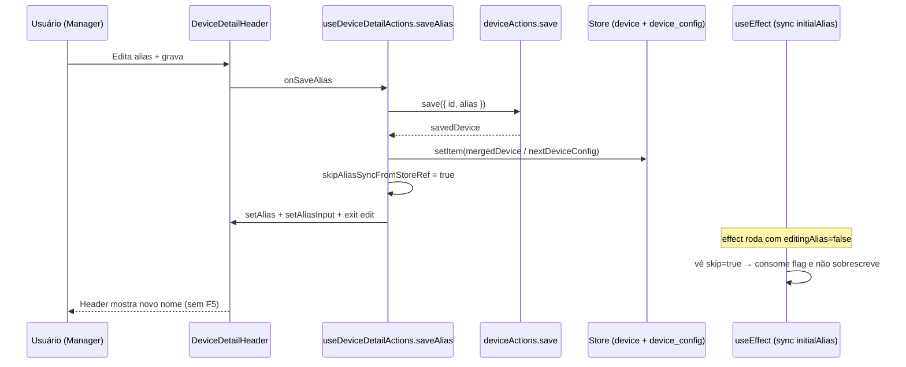

# Device Detail — sincronização do alias (nome) na UI após save

Documentação técnica da correção de feedback visual ao editar o **nome (alias)** do device na tela `/device-detail` (Manager).

**Issue de origem:** [app-community#382](https://github.com/ControleOnline/app-community/issues/382).

## Problema de negócio

Na tela de detalhe de dispositivo (`/device-detail`):

1. O usuário edita o **nome do device** e grava.
2. A alteração **é persistida** no backend (API `devices`).
3. A UI **não** refletia o novo nome até um **refresh** (F5) da página.

O feedback esperado é imediato: após save com sucesso, o valor exibido no header deve ser o novo alias **sem** reload.

## Papel no produto (`APP_TYPE`)

| Visão | O que este fluxo faz | O que **não** faz |
| --- | --- | --- |
| **MANAGER** | Rota principal: lista Dispositivos → detalhe → editar alias → save; header atualiza na hora | Não altera permissões, tipos de device nem DeviceConfig de PDV/DISPLAY |
| **ADMIN** | Pode reutilizar a mesma página compartilhada de `ui-common` quando a visão importa `DeviceDetailPage` | Não é o alvo prioritário do smoke Manager |
| **POS / PPC / SHOP / DELIVERY / CRM** | Não expõem esta tela de edição de alias de device | Não devem assumir ownership da tela de device-detail |

Fronteiras: módulo compartilhado `ui-common`; rota consumida pelo **Manager** via `ui-manager`.

## Onde vive o código

| Peça | Caminho |
| --- | --- |
| Shell da página | `ui-common` → `src/react/pages/DeviceDetailPage.js` (orquestra hooks/seções; ≤ 500 linhas após modularização) |
| Header (alias edit/save) | `src/react/pages/Devices/detail/DeviceDetailHeader.js` |
| Ações (inclui `saveAlias`) | `src/react/pages/Devices/detail/useDeviceDetailActions.js` |
| Estado local + ref de skip | `src/react/pages/Devices/detail/useDeviceDetailStateA.js` (ou estado co-localizado nos hooks de detail) |
| Merge store pós-save | `src/react/utils/deviceAliasSync.js` → `buildDeviceAliasStoreUpdates` |
| Smoke browser | `src/tests/browser/manager/device-detail-alias-save.spec.js` |
| Unit | `src/tests/react/utils/deviceAliasSync.test.js` |

Rota Manager: `ui-manager` importa `DeviceDetailPage` de `@controleonline/ui-common`.

## Causa raiz (técnica)

Havia descompasso entre:

1. **Persistência** (`deviceActions.save({ id, alias })`) — ok no backend.
2. **Estado local** (`alias` / `aliasInput` no header).
3. **Store runtime** (`device` e `device_config`), de onde `initialAlias` é derivado:

```text
initialAlias = currentDevice?.alias
  || currentDeviceConfig?.device?.alias
  || currentDevice?.device
```

Um `useEffect` sincroniza o estado local a partir de `initialAlias` quando **não** está em modo edição:

```text
useEffect(() => {
  if (editingAlias) return;
  if (skipAliasSyncFromStoreRef.current) {
    skipAliasSyncFromStoreRef.current = false;
    return;
  }
  setAlias(initialAlias || '');
  setAliasInput(initialAlias || '');
}, [editingAlias, initialAlias]);
```

Se o save atualizava só o backend (ou só o state local) **sem** atualizar o store, na saída do modo edição o efeito reaplicava o `initialAlias` antigo → a UI “voltava” ao nome anterior até um reload completo recarregar o device do servidor.

## Correção canônica

Após `deviceActions.save` com sucesso:

1. Calcular o alias definitivo (`savedDevice?.alias || trimmed`).
2. Chamar `buildDeviceAliasStoreUpdates({ deviceId, nextAlias, runtimeDevice, runtimeDeviceConfig, savedDevice, normalizeEntityId })`.
3. Persistir no store:
   - `deviceActions.setItem(mergedDevice)`
   - `deviceConfigActions.setItem(nextDeviceConfig)` quando houver config aninhada com `device.alias`
4. Armar `skipAliasSyncFromStoreRef.current = true` **antes** de atualizar o state local (evita race com o `useEffect` no mesmo ciclo).
5. `setAlias(nextAlias)`, `setAliasInput(nextAlias)`, `setEditingAlias(false)`.

### `buildDeviceAliasStoreUpdates`

Responsável por manter **device** e **device_config.device** coerentes com o alias gravado, para que `initialAlias` derivado do store não “snap back” para o valor antigo.

- Mescla o device runtime (mesmo id) com o payload salvo e força `alias`.
- Se existir `runtimeDeviceConfig`, clona e atualiza `device.alias` aninhado.

## Fluxo (Mermaid)



## Critérios de aceite (referência)

- Em `/device-detail`, após editar o nome e gravar com sucesso, o nome no header passa a ser o novo valor **sem** refresh.
- Sem regressão em outros campos editáveis da mesma tela nem na listagem de dispositivos.
- Persistência no backend permanece correta.
- Evidência: smoke `device-detail-alias-save.spec.js` (edit → PUT → texto do header com `testID` `device-alias-text` / `device-alias-input` / `device-alias-save`).

## testIDs (smoke)

| testID | Uso |
| --- | --- |
| `device-alias-text` | Texto do alias no header (modo leitura) |
| `device-alias-input` | Input em modo edição |
| `device-alias-edit` | Botão para entrar em edição |
| `device-alias-save` | Botão de confirmar save |

## Fora de escopo desta página

- Redesign da tela device-detail.
- Novas funcionalidades de device além do feedback pós-save do alias.
- Contratos de API além do `save` de device já existente.
- Configuração de PDV/DISPLAY/PRINT (ver [Smoke helpers — device-configuracao](https://github.com/ControleOnline/app-community/wiki/Smoke-Helpers-Device-Configuracao)).

## Links cruzados

- Issue: [app-community#382](https://github.com/ControleOnline/app-community/issues/382)
- Wiki do app: [Home](https://github.com/ControleOnline/app-community/wiki) · ponte [ui-common](https://github.com/ControleOnline/app-community/wiki/ui-common)
- Smoke de listagem/navegação relacionada: `ui-common/src/tests/browser/manager/devices-current.spec.js`
- Code quality / limite ≤ 500 linhas: [agents-mcp code-quality](https://github.com/ControleOnline/agents-mcp/blob/master/skills/shared/code-quality.md)
