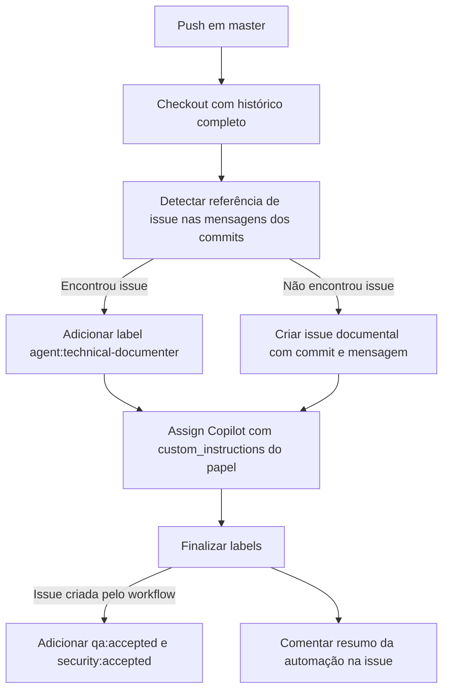

# Technical Documenter workflow

Documentação técnica da automação introduzida por `ControleOnline/ui-common` commit `155af951fb80f13180fe3d8befa1922efe6d1390` (`ci: add technical-documenter workflow`) e rastreada em `ControleOnline/ui-common#18`.

> Cópia operacional no repositório (`docs/technical/`). A wiki do módulo (`ui-common/wiki`) é a fonte primária de leitura.

## Objetivo

Registrar como o repositório abre ou prepara automaticamente a trilha de documentação técnica sempre que houver `push` em `master`.

O fluxo existe para evitar merge em `master` sem rastreabilidade documental:

- se o commit já mencionar uma issue, a issue existente recebe a trilha `technical-documenter`;
- se o commit não mencionar issue fonte, o workflow cria uma issue documental dedicada;
- em ambos os casos a automação deixa instruções explícitas para o Copilot atuar como `technical-documenter`.

## Repositórios e superfícies afetadas

| Módulo / superfície | Papel no fluxo |
| --- | --- |
| `ControleOnline/ui-common` | Repositório dono do workflow `.github/workflows/technical-documenter.yml` |
| `ControleOnline/agents-mcp` | Fonte canônica do papel `technical-documenter` e das skills obrigatórias |
| `ControleOnline/ui-common/wiki` | Destino primário da documentação técnica publicada para humanos |
| GitHub Issues do próprio repositório | Fila operacional do fluxo documental |

## Visão do módulo (`APP_TYPE`)

`ui-common` atende várias visões do app (`MANAGER`, `ADMIN`, `CRM`, `POS`, `PPC`, `SHOP`, `DELIVERY` e `SERVICE`) como base compartilhada de runtime e utilitários.

Esta automação:

- **não** é uma feature de uma visão específica;
- **não** altera contratos de UI, API ou comportamento de runtime;
- atua somente na governança documental do repositório para manter a trilha técnica encontrável depois de publicações em `master`.

## Gatilho

Arquivo: `.github/workflows/technical-documenter.yml`

```yaml
on:
  push:
    branches: [master]
```

O workflow roda apenas em `push` para `master`.

## Fluxo operacional



## Etapas detalhadas

### 1. Checkout

O job faz `actions/checkout@v4` com `fetch-depth: 0` para conseguir ler o intervalo de commits do push.

### 2. Detecção de issue fonte

O step `Detect source issue from commit messages` lê as mensagens entre `${{ github.event.before }}` e `${{ github.sha }}`. O regex aceito é:

```text
([A-Za-z0-9_.-]+/[A-Za-z0-9_.-]+)?#([0-9]+)
```

Com isso o workflow aceita tanto:

- `#123`
- `ControleOnline/ui-common#123`

Se nada for encontrado, o fluxo entra no caminho de criação automática da issue documental.

### 3. Preparar ou criar a issue documental

O step `Create or prepare issue + assign Copilot` usa `gh` com `GH_TOKEN` para dois caminhos:

| Situação | Comportamento |
| --- | --- |
| Commit com issue referenciada | Reusa a issue encontrada, adiciona `agent:technical-documenter` e envia `agent_assignment` para `copilot-swe-agent[bot]` |
| Commit sem issue referenciada | Cria issue com título `docs: documentação técnica automática (push master <sha>)`, corpo com SHA + mensagem do commit, label `agent:technical-documenter` e atribuição inicial ao Copilot |

As `custom_instructions` embutidas no payload exigem:

- seguir o papel canônico `technical-documenter` em `agents-mcp`;
- tratar a wiki técnica como fonte primária;
- usar as labels `agent:technical-documenter` e `agent:technical-documenter:done`;
- **não** implementar código de produto.

### 4. Finalização automática de labels

O step `Finalize labels` sempre:

- adiciona `agent:technical-documenter:done`;
- remove `agent:technical-documenter` quando presente.

Quando a issue foi criada automaticamente pelo próprio workflow, ele também tenta adicionar:

- `qa:accepted`
- `security:accepted`

e publica um comentário informando que a documentação técnica automática foi disparada.

## Contrato de labels e comentários

| Artefato | Uso |
| --- | --- |
| `agent:technical-documenter` | Marca a solicitação enquanto a trilha documental está aberta |
| `agent:technical-documenter:done` | Marca a trilha documental como concluída |
| `qa:accepted` / `security:accepted` | Aplicados apenas no caminho em que a issue foi criada automaticamente |
| Comentário na issue | Registra que a automação disparou e deixa o histórico visível para humanos |

## Limites e cuidados

- O workflow depende de `GH_TOKEN` com permissão para `issues: write` e `pull-requests: write`.
- O parser usa apenas a **primeira** referência de issue encontrada nas mensagens do push.
- O fluxo opera sobre GitHub Issues; não usa ProjectV2 para decidir elegibilidade.
- A automação prepara a trilha documental, mas a documentação humana continua devendo existir na wiki do módulo e, quando fizer sentido, em `docs/technical/`.
- O conteúdo publicado não deve expor credenciais, dados reais ou links privados.

## Verificação manual

Checklist mínimo quando esse workflow mudar:

1. validar se o `push` em `master` continua acionando o job;
2. conferir se commits com `#issue` reaproveitam a issue correta;
3. conferir se commits sem referência criam a issue `docs: documentação técnica automática...`;
4. revisar se as labels finais e o comentário esperado continuam sendo aplicados;
5. confirmar se o texto de `custom_instructions` ainda aponta para a fonte canônica em `agents-mcp`.

## Links cruzados

| Destino | URL |
| --- | --- |
| Home do módulo | https://github.com/ControleOnline/ui-common/wiki |
| Wiki principal do app | https://github.com/ControleOnline/app-community/wiki |
| Visões do app (`APP_TYPE`) | https://raw.githubusercontent.com/ControleOnline/app-community/master/MODOS_OPERACAO.md |
| Issue de origem | https://github.com/ControleOnline/ui-common/issues/18 |
| Commit documentado | https://github.com/ControleOnline/ui-common/commit/155af951fb80f13180fe3d8befa1922efe6d1390 |
| Workflow | https://github.com/ControleOnline/ui-common/blob/master/.github/workflows/technical-documenter.yml |
